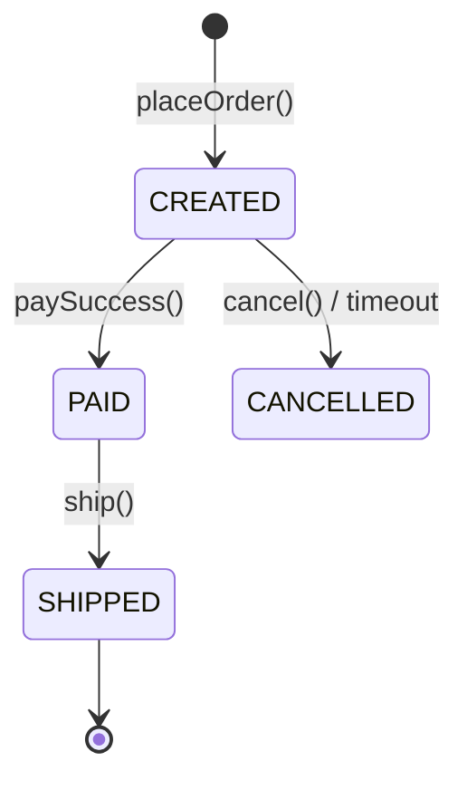

# [[Order]] (订单聚合根)

> 描述：用户购买商品的核心凭证，负责管理订单项、计算金额并协调库存锁定。

## 1. 核心结构 (State)

### 实体 (Entities)
* **Root:** `Order` (本聚合根)
    * `orderId`: String (全局唯一ID)
    * `status`: [[OrderStatus]] (枚举：CREATED, PAID, CANCELLED...)
    * `totalAmount`: [[Money]] (值对象，防止精度丢失)

* **Children:**
    * `items`: List<[[OrderItem]]> (订单项)

### 值对象 (Value Objects)
* `shippingAddress`: [[Address]] (收货地址快照)
* `createTime`: DateTime

---

## 2. 行为与规则 (Behaviors & Invariants)

### 2.1 创建订单 (Factory)
* **Command:** `PlaceOrderCmd`
* **Input:** `userId`, `List<SkuId, Qty>`, `AddressId`
* **Invariants (强一致性规则):**
    1. 订单项不能为空。
    2. 单笔订单总额不能超过 100万 (风控规则)。
* **Output:** `OrderCreatedEvent`

### 2.2 支付成功
* **Method:** `paySuccess(paymentId, time)`
* **Logic:**
    1. 检查状态必须为 `CREATED`。
    2. 修改状态为 `PAID`。
* **Output:** `OrderPaidEvent`

---

## 3. 生命周期 (Lifecycle State Machine)

